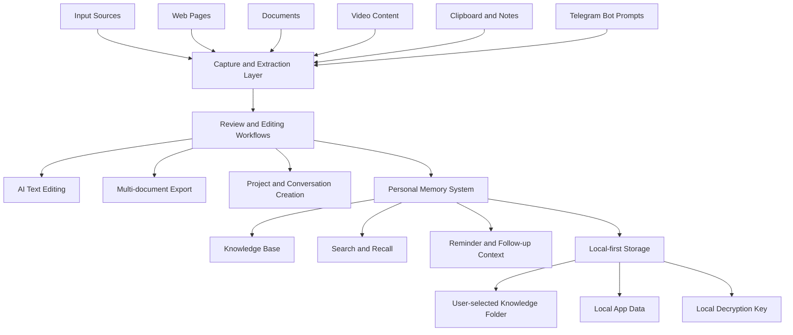

# InsightCAP Community

InsightCAP Community is the public community repository for InsightCAP.

InsightCAP is a local-first desktop application for capturing, extracting,
organizing, editing, searching, and revisiting personal knowledge. It helps users
turn web pages, documents, videos, notes, conversations, and other content into a
searchable personal memory system.

The Community Edition provides a public entry point for users, reviewers, and
future contributors while keeping proprietary implementation details outside this
repository.

## What InsightCAP Does

InsightCAP Community focuses on local-first personal knowledge workflows:

- Capture and extract content from multiple content types, including web pages,
  documents, and video content.
- Organize captured content into a personal memory and knowledge system.
- Search, revisit, and reuse knowledge across projects and conversations.
- Create new projects and new conversations around captured knowledge.
- Edit AI-generated or AI-assisted text in a structured editor.
- Export multiple documents from organized knowledge workflows.
- Use Telegram bot reminder and prompt workflows for follow-up actions.
- Keep user data local by default, with explicit controls for knowledge base
  location and local app data.

## Architecture Overview

## Key Workflows

### Multi-type Content Extraction

InsightCAP is designed to process different kinds of content, including:

- Web pages.
- Local documents.
- Video content.
- Clipboard captures.
- Notes and structured text.
- Telegram bot prompt inputs.

The goal is to reduce manual copying and reorganizing, so users can move from
raw content to searchable knowledge faster.

### Personal Memory System

Captured content is organized into a personal memory system that supports:

- Knowledge storage.
- Recall and search.
- Project-oriented organization.
- Conversation-oriented reuse.
- Reminder and follow-up workflows.

### Projects and Conversations

InsightCAP supports workflows for creating new projects and new conversations
from collected knowledge. This helps users keep research, writing, planning, and
follow-up work connected to the original source material.

### AI Text Editing

InsightCAP includes AI-assisted text editing workflows for turning captured
content into more useful written output, summaries, notes, or structured drafts.

### Telegram Bot Reminder and Prompt Workflows

Telegram bot workflows can be used for reminder-style prompts, follow-up input,
and lightweight capture or action flows outside the main desktop window.

### Multi-document Export

InsightCAP supports exporting multiple documents from organized knowledge and
editing workflows, helping users move useful content out of the app when needed.

## Current Status

This repository is currently prepared as a private staging repository before
public release.

Public release readiness work is focused on:

- Clear public documentation.
- Explicit license scope.
- Clean Git history.
- No personal information or local development metadata.
- Release artifacts distributed through GitHub Releases.

## Download

Community Edition installers will be distributed through GitHub Releases:

https://github.com/3k1c/insightcap-community/releases

Installer files and binary artifacts should not be committed directly to this
repository.

## Repository Contents

This repository contains:

- Public product overview.
- Community Edition installation guidance.
- High-level architecture documentation.
- Privacy and local-data notes.
- Open source scope documentation.
- Licensing information.

Selected community-facing source code may be added later after review.

## Documentation

- [Architecture](docs/architecture.md)
- [Installation](docs/installation.md)
- [Privacy and Data](docs/privacy-and-data.md)
- [Open Source Scope](docs/open-source-scope.md)
- [Release Checklist](docs/release-checklist.md)

## Licensing

Source code and documentation in this repository are licensed under the MIT
License unless otherwise stated.

InsightCAP Community Edition binaries are free to use for personal and
commercial purposes under the Community Edition License.

The Community Edition License describes the usage terms for Community Edition
binaries and public release materials. It is not a substitute for legal advice.
If a formal installer EULA is required, the installer should present the license
for explicit user acceptance during installation.

Commercial Edition features, proprietary modules, hosted services, enterprise
licensing, and private source code are not included in the Community Edition
License.

See:

- [LICENSE](LICENSE)
- [COMMUNITY-LICENSE.md](COMMUNITY-LICENSE.md)
- [Open Source Scope](docs/open-source-scope.md)

## Public and Private Boundary

This repository is not a full mirror of the private InsightCAP development
repository.

Included public materials may include documentation, selected non-sensitive
source code, release notes, and Community Edition licensing information.

Not included:

- Private source code.
- Proprietary modules.
- Commercial Edition features.
- Hosted services.
- Enterprise licensing materials.
- Internal prompts or policies.
- Private roadmap and planning documents.
- User data, local databases, caches, credentials, or development machine
  metadata.

## Privacy and Public Readiness

Before this repository is made public, and before each future release, contents
should be reviewed for personal data, local development metadata, credentials,
and internal-only information.

See:

- [Privacy and Data](docs/privacy-and-data.md)
- [Release Checklist](docs/release-checklist.md)

## Links

- GitHub: https://github.com/3k1c/insightcap-community
